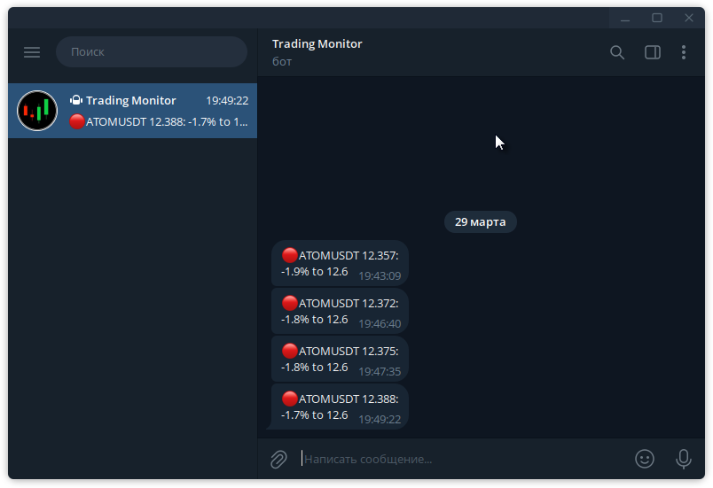

# bybit_price_monitor

For Bybit Crypto Exchange: Price monitor, using Pybit lib.

https://github.com/sergeymusenko/bybit_price_monitor

Works as cron script. Start it each hour. 
Checks prices of coins comparing to price levels in `coinlist.py` and sends Telegram signals on moving close. 
Not using Bybit authorization. 
Can check prices on 'linear' (futures) or 'spot' market, see `config.py`.

In Telegram message:

- "green" mark means we going down to the price level - time to buy,
- "red" mark means we going up to the price level - time to sell.

Send signal again if we moved closer or changed price level. Otherwize no repeat same coin signal.

Last sent json file format: `{'symbol': ['%', 'priceLevel', 'lastPrice', 'dateTime'],}`

How to connect to Telegram: see instructions in `simple_telegram.py` module. 
You can send to a group or to user account personally, see `config.py`.

**Docs:** https://bybit-exchange.github.io/docs/v5/intro

**Installation:** `pip install pybit`

**Telegram message example: **
