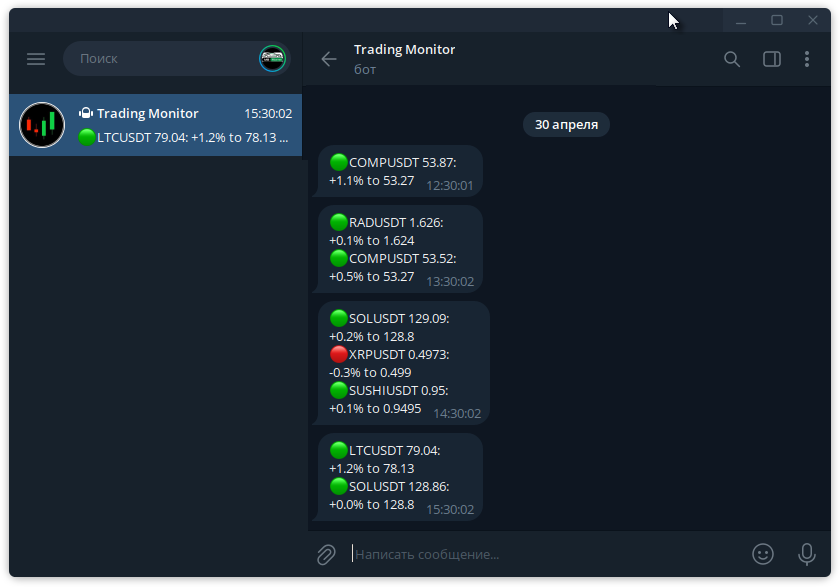

# coin_price_monitor

For Crypto Exchange: Price monitor, using Binance public API.

https://github.com/sergeymusenko/coin_price_monitor

Uses Binance public API to get tickers: https://api.binance.com/api/v3/ticker/price?symbols=[...] 
Checks prices of coins comparing to price levels in `coinlist.py` and sends Telegram signals on getting close. 
Send signal again if price moved closer or changed price setting level. Otherwize no repeat same signal.

Works as a cron script. Start it each 5-10 min. Use: `crontab -e`
> \# coin_price_monitor: each *:10 
> */10 * * * *   /pathto/coin_price_monitor/main.py 2>&1 | tee -a /pathto/coin_price_monitor/cron-log.txt

In Telegram message:
>	"green/up" mark means price is going up 
>	"red/down" mark means price is going down 
>	"+n% to nnn.nn" means "higher then nnn.n price setting" 
>	"-n% to nnn.nn" means "lower then nnn.n price setting"

Last sent json file format: `{'symbol': ['%', 'priceLevel', 'lastPrice', 'dateTime'],}` 
Last price json file format: {'symbol': [priceold, ..., pricenew],}

How to connect to Telegram: see instructions in `simple_telegram.py` module. 
You can send to a group or to user account personally, see `config.py`.

**Telegram message example: **

